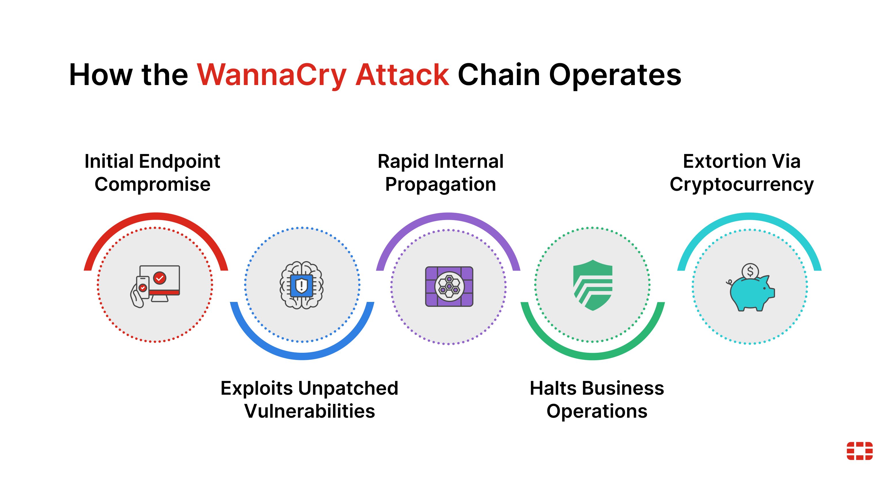
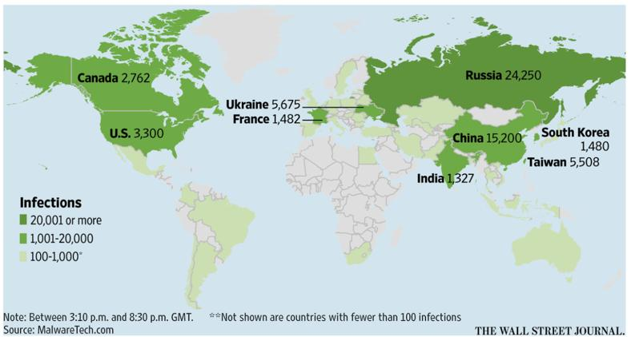
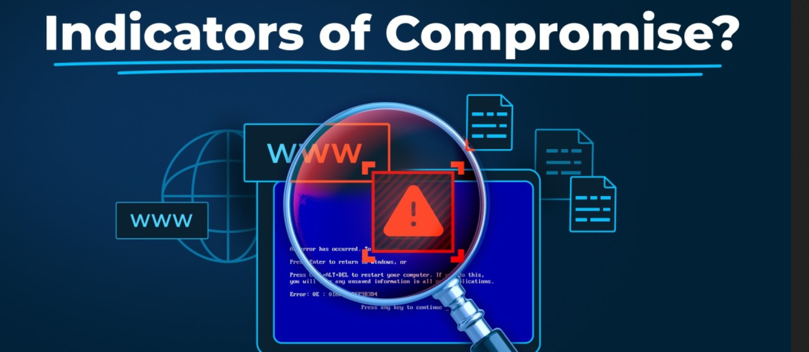

# Technical Analysis of the WannaCry Ransomware Cyberattack


> **A Technical Malware Case Study on the Global WannaCry Ransomware Outbreak (2017)**

---

## Author

**Junaid Maqbool Sharif (JUN41D)**

**Date:** 05 July 2026

**Estimated Reading Time:** 25–30 Minutes

---

> **Disclaimer**
>
> This case study has been created for **educational and cybersecurity research purposes only**. The objective of this document is to analyze the WannaCry ransomware attack, understand its technical operation, identify defensive strategies, and derive lessons valuable for both blue team and red team professionals.

---

# Table of Contents

1. Executive Summary
2. Background
3. Timeline
4. Threat Actor
5. Technical Analysis
6. MITRE ATT&CK Mapping
7. Indicators of Compromise
8. Detection Opportunities
9. Defensive Recommendations
10.Lessons for Red Teams
11.Key Takeaways
12.References

---

# 1. Executive Summary


## Overview

The **WannaCry ransomware attack** was one of the most destructive cyberattacks in modern history. First observed on **12 May 2017**, WannaCry rapidly evolved into a global cyber crisis by exploiting a critical vulnerability in Microsoft's Server Message Block (SMBv1) protocol.

Unlike traditional ransomware that relied on phishing emails or malicious downloads, WannaCry functioned as a **cryptoworm**, meaning it could automatically spread across vulnerable systems without requiring user interaction. Within hours of its initial release, the malware infected hundreds of thousands of Windows computers across the globe.

The attack exploited **CVE-2017-0144**, a vulnerability in the SMBv1 protocol using the leaked **EternalBlue** exploit, which was allegedly developed by the United States National Security Agency (NSA) and later leaked by a hacking group known as **The Shadow Brokers**.

Once executed, the malware encrypted user files and displayed a ransom note demanding payment in **Bitcoin**. Victims were instructed to pay **$300 USD**, which doubled after several days if payment was not received. Failure to pay within the specified timeframe threatened permanent loss of encrypted files.

---

## What Happened?



WannaCry was a self-propagating ransomware worm that targeted Microsoft Windows systems vulnerable to **SMBv1 Remote Code Execution (CVE-2017-0144)**.

The malware leveraged the **EternalBlue** exploit to gain unauthorized access to vulnerable machines over **TCP Port 445**. After successfully compromising one system, it automatically scanned local and external networks for additional vulnerable hosts, allowing it to spread at unprecedented speed.

Unlike many ransomware families, WannaCry did **not** rely on user interaction such as opening malicious email attachments. Instead, the worm exploited unpatched systems directly over the network.

---

## Who Was Affected?



The attack infected approximately **230,000 computers** across **more than 150 countries** within a matter of days.

Some of the most heavily affected organizations included:

- United Kingdom National Health Service (NHS)
- Telefónica (Spain)
- FedEx
- Renault
- Nissan
- Deutsche Bahn
- Honda
- Russia's Interior Ministry
- Universities, banks, energy providers, government agencies, and telecommunications companies worldwide

Although no specific industry was intentionally targeted, organizations operating **legacy Windows systems** or those that had failed to apply Microsoft's security updates experienced the greatest impact.

---

## When Did It Occur?

The global outbreak began on **12 May 2017** at approximately **07:45 UTC**.

Within only a few hours, thousands of organizations around the world experienced widespread disruption as the malware autonomously propagated through vulnerable networks.

The first wave of infections continued until cybersecurity researcher **Marcus Hutchins** discovered and activated the malware's embedded **kill switch**, significantly slowing the spread of the initial variant.

---

## Impact

The WannaCry ransomware attack had far-reaching operational, financial, and societal consequences.

Major impacts included:

- Encryption of critical business and personal data
- Operational disruption across healthcare, manufacturing, transportation, and government sectors
- Millions of dollars in recovery and remediation costs
- Significant downtime for essential public services
- Reputational damage for affected organizations
- Increased public awareness regarding ransomware threats
- Global reassessment of patch management and legacy system security

Although the ransom demand was relatively small compared to modern ransomware campaigns, the overall financial impact of recovery efforts is estimated to have reached **billions of dollars worldwide**.

---

## Why Is This Incident Significant?

WannaCry fundamentally changed how governments and organizations viewed ransomware.

The incident demonstrated that:

- A single unpatched vulnerability could trigger a worldwide cyber crisis.
- Government-developed cyber weapons could become major threats if leaked.
- Poor patch management can have catastrophic consequences.
- Legacy systems remain one of the largest attack surfaces in enterprise environments.
- Ransomware is capable of disrupting critical infrastructure and public safety, making it a national security concern rather than merely a financial crime.

---

# 2. Background


Understanding WannaCry requires examining the events that occurred before the attack itself.

---

## The Shadow Brokers

The **Shadow Brokers** emerged during 2016 as an anonymous hacking group that began publishing encrypted archives containing sophisticated cyber weapons allegedly stolen from the **United States National Security Agency (NSA)**.

Their online posts were intentionally written in broken English, leading many researchers to speculate about their identity and motivations.

In April 2017, the group publicly released a collection of offensive tools belonging to the NSA's **Equation Group**. Among these leaked tools was **EternalBlue**, which would later become the primary exploit used by WannaCry.

The publication of these exploits marked one of the most significant intelligence leaks in cybersecurity history.

---

## EternalBlue


### Overview

**EternalBlue** is a remote code execution exploit targeting Microsoft's **Server Message Block version 1 (SMBv1)** protocol.

The exploit abuses a vulnerability identified as:

```text
CVE-2017-0144
```

By sending specially crafted SMB packets to a vulnerable Windows system, EternalBlue allows an attacker to execute arbitrary code remotely without authentication.

Successful exploitation grants kernel-level code execution, enabling attackers to install malware, move laterally, or deploy additional payloads.

---

### Why Was EternalBlue So Dangerous?

Several characteristics made EternalBlue exceptionally dangerous:

- Remote Code Execution (RCE)
- No user interaction required
- Network-based propagation
- Kernel-level access
- Wormable behavior
- Extremely reliable exploitation against unpatched systems

Unlike phishing attacks, EternalBlue enabled attackers to compromise systems simply because they were reachable over the network.

---

## DoublePulsar


**DoublePulsar** is a kernel-mode backdoor that was frequently deployed after successful EternalBlue exploitation.

Once installed, DoublePulsar enabled attackers to inject malicious code directly into compromised systems, simplifying the deployment of malware such as WannaCry.

Although WannaCry primarily relied on EternalBlue for propagation, DoublePulsar has often been discussed alongside the attack because both tools originated from the same NSA leak.

---

## Organizations Affected

Unlike targeted ransomware campaigns, WannaCry did not discriminate based on industry or geography.

Organizations affected included:

- Healthcare providers
- Government agencies
- Banks
- Telecommunications companies
- Railways
- Universities
- Manufacturing companies
- Energy providers
- Internet Service Providers (ISPs)
- Small and medium-sized businesses
- Large multinational enterprises

The malware targeted any vulnerable Windows system exposed to the network.

---

## Attack Surface

The primary attack surface consisted of Windows systems running the vulnerable **SMBv1** protocol.

Affected operating systems included:

### Client Operating Systems

- Windows XP
- Windows Vista
- Windows 7
- Windows 8
- Windows 8.1
- Early versions of Windows 10

### Server Operating Systems

- Windows Server 2003
- Windows Server 2008
- Windows Server 2012
- Windows Server 2016 (unpatched systems)

Systems that had not installed Microsoft's **MS17-010** security update remained vulnerable to exploitation.

---

# 3. Timeline


| Date | Event |
|------|-------|
| **14 March 2017** | Microsoft released security bulletin **MS17-010**, addressing multiple SMB vulnerabilities including **CVE-2017-0144**. |
| **14 April 2017** | The Shadow Brokers publicly leaked EternalBlue and other NSA offensive cyber tools. |
| **12 May 2017 (≈07:45 UTC)** | WannaCry ransomware began spreading globally, exploiting SMBv1 vulnerabilities on unpatched Windows systems. |
| **12 May 2017** | Major organizations including the UK's National Health Service (NHS), Telefónica, FedEx, Renault, and Deutsche Bahn experienced widespread operational disruption. |
| **12 May 2017 (≈15:03 UTC)** | British cybersecurity researcher **Marcus Hutchins** (MalwareTech) discovered and registered the malware's hidden kill-switch domain, significantly slowing the first wave of infections. |
| **13–15 May 2017** | Microsoft released emergency security updates for unsupported operating systems, including Windows XP, Windows Server 2003, and Windows 8. |
| **Following Weeks** | Security vendors, governments, and incident response teams coordinated global remediation efforts while organizations accelerated patch deployment and disabled SMBv1 services. |

---

> **Key Observation**
>
> The WannaCry outbreak highlighted that the majority of affected systems had **not installed Microsoft's MS17-010 security update**, despite it being available approximately two months before the attack began. This remains one of the most widely cited examples of why effective vulnerability and patch management are critical components of cybersecurity.


---

# 4. Threat Actor


## Attribution

Unlike many modern ransomware campaigns, the WannaCry attack was not immediately attributed to a specific threat actor. However, following extensive investigations conducted by cybersecurity researchers and intelligence agencies, the attack has been **widely attributed to the Lazarus Group**, a state-sponsored cyber threat group associated with **North Korea**.

Although definitive attribution in cyberspace is inherently difficult, governments including the **United States**, **United Kingdom**, **Australia**, and several other allied nations publicly concluded that North Korea was responsible for the attack.

It is important to distinguish between the two groups commonly associated with WannaCry:

| Group | Role |
|--------|------|
| **The Shadow Brokers** | Leaked the NSA's offensive cyber tools, including the EternalBlue exploit. |
| **Lazarus Group** | Believed to have developed and deployed the WannaCry ransomware using the leaked EternalBlue exploit. |

---

## About the Lazarus Group

The **Lazarus Group** is one of the world's most well-known Advanced Persistent Threat (APT) groups. It has been linked to several high-profile cyberattacks, including:

- Sony Pictures Attack (2014)
- Bangladesh Bank SWIFT Heist (2016)
- WannaCry Ransomware (2017)
- Multiple cryptocurrency exchange attacks

Unlike financially motivated cybercriminal groups, Lazarus is widely believed to conduct operations that support the strategic and economic interests of the North Korean government.

---

## Attack Motivation

Although WannaCry demanded ransom payments in Bitcoin, researchers generally believe that **financial gain was not the sole objective**.

Possible motivations include:

- Financial extortion
- Demonstration of cyber capabilities
- Large-scale disruption of critical infrastructure
- Exploitation of globally vulnerable systems
- Testing the effectiveness of leaked offensive cyber tools

Regardless of the original intent, the attack caused billions of dollars in economic damage worldwide.

---

# 5. Technical Analysis


## Attack Overview

WannaCry is classified as a **cryptoworm**, combining the characteristics of both ransomware and a network worm.

Unlike conventional ransomware that depends on phishing emails or malicious downloads, WannaCry automatically propagated through vulnerable Windows systems by exploiting the **SMBv1 Remote Code Execution vulnerability (CVE-2017-0144)** using the **EternalBlue** exploit.

After compromising a single vulnerable host, the malware scanned local and external networks to identify additional systems exposing **TCP Port 445**, allowing it to spread rapidly without requiring any user interaction.

The simplified attack flow is shown below:

```text
Internet
     │
     ▼
Unpatched Windows Host
     │
     ▼
Exploit SMBv1 (EternalBlue)
     │
     ▼
Remote Code Execution
     │
     ▼
Deploy WannaCry Payload
     │
     ▼
Encrypt User Files
     │
     ▼
Display Ransom Note
     │
     ▼
Scan Network for More Victims
     │
     ▼
Repeat
```

---

# 5.1 Initial Access


## MITRE ATT&CK

**T1210 – Exploitation of Remote Services**

### Description

Initial access was achieved by exploiting **CVE-2017-0144**, a critical vulnerability affecting Microsoft's **SMBv1** protocol.

Rather than relying on phishing or user interaction, attackers used the leaked **EternalBlue** exploit to send specially crafted SMB packets to vulnerable systems listening on **TCP Port 445**.

Successful exploitation resulted in **Remote Code Execution (RCE)**, allowing WannaCry to execute directly on the target machine.

### Key Points

- Exploited SMBv1 vulnerability
- Used EternalBlue exploit
- No authentication required
- No user interaction required
- Remote Code Execution achieved

---

# 5.2 Execution


## MITRE ATT&CK

**T1059 – Command and Scripting Interpreter (Windows)**

### Description

Once executed, WannaCry immediately deployed its ransomware payload and began encrypting user files across local drives and accessible network shares.

The malware generated encryption keys using a combination of **RSA-2048** and **AES-128** cryptographic algorithms, making recovery without the private key practically impossible.

After encryption completed, the malware displayed the **Wana Decrypt0r** ransom interface, demanding payment of **$300 USD in Bitcoin**.

Victims were informed that:

- The ransom amount would double after three days.
- Files would supposedly be deleted permanently after seven days if payment was not received.

Simultaneously, the malware continued scanning the network for additional vulnerable hosts.

---

# 5.3 Persistence


## MITRE ATT&CK

**T1547.001 – Registry Run Keys / Startup Folder**

### Description

Although WannaCry primarily focused on rapid propagation rather than long-term persistence, it established mechanisms to maintain execution during the infection process.

The malware created Windows services and Registry Run entries to ensure that its ransomware component could execute after system reboot if necessary.

Because WannaCry spread autonomously within minutes, persistence played a less significant role than in traditional Advanced Persistent Threat (APT) operations.

---

# 5.4 Privilege Escalation


## Assessment

No dedicated privilege escalation technique has been conclusively identified as part of WannaCry's primary attack chain.

The EternalBlue exploit already provided sufficient privileges to execute arbitrary code on vulnerable systems, eliminating the need for additional privilege escalation after compromise.

---

# 5.5 Credential Access


## Assessment

Unlike many modern ransomware families, WannaCry did **not** attempt to steal user credentials or dump password hashes.

There is no publicly available evidence indicating the use of:

- LSASS dumping
- Mimikatz
- Pass-the-Hash
- Kerberos abuse
- Credential harvesting

Its primary objective was rapid propagation followed by file encryption.

---

# 5.6 Defense Evasion


## MITRE ATT&CK

**T1027 – Obfuscated Files or Information**

### Description

WannaCry incorporated several techniques intended to complicate analysis and detection.

These included:

- Obfuscated executable components
- Dynamically generated encryption keys
- Execution as a Windows service
- Automated removal of recovery options in some variants
- Kill-switch domain verification before execution

Although the malware did not exhibit the sophisticated evasion capabilities commonly found in modern ransomware, these techniques reduced detection by traditional signature-based antivirus solutions at the time.

---

# 5.7 Discovery


## MITRE ATT&CK

**T1046 – Network Service Discovery**

### Description

Before propagating further, WannaCry actively scanned local and external IP ranges searching for systems exposing **SMB services** over **TCP Port 445**.

The malware automatically identified vulnerable Windows hosts capable of being exploited using EternalBlue.

This discovery process enabled autonomous propagation without requiring attacker interaction.

---

# 5.8 Lateral Movement


## MITRE ATT&CK

**T1210 – Exploitation of Remote Services**

### Description

Following successful compromise, WannaCry propagated throughout internal networks by exploiting the same SMB vulnerability on additional hosts.

Unlike many ransomware campaigns that rely on stolen administrator credentials or remote management tools such as PsExec, WannaCry performed **worm-like lateral movement** using EternalBlue.

This autonomous behavior enabled infections to spread across thousands of systems within hours.

### Propagation Process

```text
Victim 1
    │
    ▼
Scan Network
    │
    ▼
Locate TCP Port 445
    │
    ▼
Exploit EternalBlue
    │
    ▼
Deploy Payload
    │
    ▼
Repeat
```

---

# 5.9 Collection


## Assessment

WannaCry did **not** collect sensitive information prior to encryption.

Instead, the malware directly targeted files stored on:

- Local drives
- Connected storage devices
- Accessible network shares

Common file types included:

- Documents
- Images
- Databases
- Archives
- Source code
- Office files

The objective was to maximize operational disruption by encrypting valuable user data.

---

# 5.10 Exfiltration


## Assessment

No credible evidence suggests that WannaCry exfiltrated victim data before encryption.

Unlike modern double-extortion ransomware groups, WannaCry focused exclusively on encrypting files and demanding ransom payments.

This distinction is significant because many contemporary ransomware operations combine encryption with data theft to increase pressure on victims.

---

# 5.11 Impact


The WannaCry outbreak became one of the largest ransomware incidents ever recorded.

Major consequences included:

## Financial Impact

- Billions of dollars in global recovery costs
- Operational losses across multiple industries
- Incident response and remediation expenses
- Business continuity disruptions

---

## Operational Impact

- Hospitals cancelled surgeries and appointments
- Manufacturing plants halted production
- Transportation services experienced outages
- Government agencies faced service interruptions

---

## Reputational Impact

Organizations suffered:

- Loss of customer trust
- Negative media coverage
- Regulatory scrutiny
- Long-term reputational damage

---

## Cybersecurity Impact

Perhaps the most significant outcome of WannaCry was its influence on global cybersecurity practices.

The attack demonstrated that:

- Unpatched systems remain one of the greatest enterprise risks.
- Legacy operating systems create significant security exposure.
- Network segmentation is essential for limiting worm propagation.
- Timely vulnerability management can prevent large-scale cyber incidents.
- Offensive cyber tools leaked from intelligence agencies can become major threats when released publicly.

---

## Technical Summary

| Category | Details |
|----------|---------|
| Malware Type | Ransomware Cryptoworm |
| Primary Exploit | EternalBlue |
| Vulnerability | CVE-2017-0144 |
| Target Protocol | SMBv1 |
| Port Used | TCP 445 |
| Encryption | AES-128 + RSA-2048 |
| Initial Infection | Remote Code Execution |
| User Interaction Required | No |
| Propagation | Automatic Worm |
| Primary Objective | File Encryption & Ransom |
| Kill Switch | Yes (Discovered by Marcus Hutchins) |

---

---

# 6. MITRE ATT&CK Mapping


The following table maps the observed behaviors of WannaCry to the MITRE ATT&CK framework. Only techniques supported by publicly available technical analysis have been included.

| ATT&CK Tactic | Technique | Technique ID | Evidence |
|---------------|-----------|--------------|----------|
| Initial Access | Exploitation of Remote Services | **T1210** | EternalBlue exploited SMBv1 (CVE-2017-0144). |
| Execution | Command and Scripting Interpreter: Windows Command Shell | **T1059.003** | Malware executed its payload after successful exploitation. |
| Persistence | Registry Run Keys / Startup Folder | **T1547.001** | Registry entries and services allowed execution after reboot. |
| Defense Evasion | Obfuscated Files or Information | **T1027** | Obfuscated malware components complicated analysis. |
| Discovery | Network Service Discovery | **T1046** | Scanned local and external IP ranges for SMB services. |
| Lateral Movement | Exploitation of Remote Services | **T1210** | Propagated using EternalBlue across vulnerable hosts. |
| Impact | Data Encrypted for Impact | **T1486** | Encrypted victim files and demanded ransom. |

> **Note:** There is **no confirmed evidence** that WannaCry used phishing, credential dumping, PsExec, or data exfiltration as part of its primary attack chain. These techniques are therefore intentionally omitted.

---

# 7. Indicators of Compromise (IoCs)



Indicators of Compromise (IoCs) help security teams identify systems that may have been infected with WannaCry.

## Files

| File | Description |
|------|-------------|
| `tasksche.exe` | Main WannaCry executable |
| `taskdl.exe` | Secondary malware component |
| `taskse.exe` | Supporting executable |
| `@WanaDecryptor@.exe` | Ransomware interface |
| `@Please_Read_Me@.txt` | Ransom note |

---

## Services

| Service | Purpose |
|----------|---------|
| `mssecsvc2.0` | Service created by WannaCry to facilitate propagation |

---

## File Extension

Encrypted files commonly retained their original extension but were inaccessible. The ransom interface (`@WanaDecryptor@`) informed victims of the encryption status.

---

## Network Indicators

- SMB traffic over **TCP Port 445**
- Large numbers of outbound SMB connection attempts
- Network scanning behavior targeting internal and external IP addresses
- Communication with the malware's kill-switch domain (initial variant)

---

## Registry

Potential Registry Run entries may be created to maintain execution after reboot.

---

## Vulnerability

```text
CVE-2017-0144
```

---

## Microsoft Security Bulletin

```text
MS17-010
```

---

# 8. Detection Opportunities


Early detection of WannaCry activity could significantly reduce its impact by preventing widespread lateral movement.

---

## Network Detection

Security teams should monitor for:

- Unusual SMB traffic over TCP Port 445
- Rapid SMB scanning across internal networks
- High volumes of failed SMB connection attempts
- Sudden east-west network traffic
- Connections to known WannaCry kill-switch domains (historically)

---

## Endpoint Detection

Endpoint Detection and Response (EDR) solutions should alert on:

- Execution of `tasksche.exe`
- Creation of `mssecsvc2.0`
- Mass file modifications within a short period
- Unexpected encryption of user documents
- Execution of `@WanaDecryptor@.exe`
- Creation of ransom note files

---

## SIEM Detection

Potential detection rules include:

- Multiple SMB exploit attempts from a single host
- Excessive file creation and modification events
- New Windows service creation
- Registry Run key modifications
- Abnormal process execution from temporary directories

---

## Threat Hunting Ideas

Threat hunters should investigate:

- Systems exposing SMBv1
- Hosts communicating over TCP Port 445
- Unpatched Windows systems
- Legacy operating systems
- Evidence of EternalBlue exploitation
- Suspicious SMB scanning behavior

---

# 9. Defensive Recommendations


The WannaCry outbreak demonstrated that effective cybersecurity depends on multiple layers of defense rather than a single security control.

---

## Identity Security

### Multi-Factor Authentication (MFA)

Require MFA wherever possible to reduce the impact of compromised credentials.

### Least Privilege

Users should operate without administrative privileges unless absolutely necessary.

### Privileged Access Management (PAM)

Protect privileged accounts using dedicated access management solutions.

---

## Network Security

### Disable SMBv1

SMBv1 is obsolete and should be disabled across enterprise environments.

### Network Segmentation

Separate critical infrastructure from user workstations to limit lateral movement.

### Firewalls

Restrict inbound and outbound SMB traffic whenever possible.

### Network Access Control (NAC)

Prevent vulnerable or unmanaged systems from joining production networks.

---

## Endpoint Security

### Endpoint Detection and Response (EDR)

Deploy EDR solutions capable of detecting ransomware behavior rather than relying solely on signatures.

### Application Control

Restrict execution of unauthorized software.

### Antivirus

Maintain up-to-date endpoint protection.

### Logging

Enable detailed Windows logging to support incident response and forensic investigations.

---

## Monitoring

### Security Information and Event Management (SIEM)

Centralize logs from:

- Windows Event Logs
- Firewalls
- EDR
- IDS/IPS
- Domain Controllers

### User and Entity Behavior Analytics (UEBA)

Identify abnormal host behavior and lateral movement.

### Threat Hunting

Perform proactive hunts for:

- SMB scanning
- EternalBlue exploitation attempts
- Suspicious Windows service creation
- Mass file encryption

---

## Patch Management

The most effective defense against WannaCry was applying Microsoft's security update **MS17-010** before the attack occurred.

Organizations should:

- Maintain a complete asset inventory.
- Perform regular vulnerability assessments.
- Prioritize critical security updates.
- Remove unsupported operating systems.
- Establish a formal patch management process.

---

## Backup Strategy

Organizations should maintain:

- Offline backups
- Immutable backups
- Regular backup testing
- Disaster recovery plans

Backups remain one of the most effective mitigations against ransomware.

---

# 10. Lessons for Red Teams


Although WannaCry was a criminal malware campaign, it provides valuable lessons for penetration testers and red team operators.

## Key Lessons

### Patch Management Remains Critical

A single missing security update enabled one of the largest ransomware outbreaks in history.

During security assessments, identifying unpatched systems should remain a high priority.

---

### Legacy Systems Create Significant Risk

Older operating systems frequently remain in production despite no longer receiving security updates.

These systems often represent the weakest point in an enterprise network.

---

### Network Segmentation Limits Worm Propagation

Flat enterprise networks allowed WannaCry to spread rapidly.

Well-designed segmentation could have significantly reduced its impact.

---

### Continuous Vulnerability Management Matters

Organizations should continuously monitor for:

- Unsupported operating systems
- SMBv1 exposure
- Critical missing patches
- Internet-exposed services

---

### Defense-in-Depth is Essential

No single security control can prevent every attack.

Organizations should combine:

- Patch management
- EDR
- Network segmentation
- Firewalls
- SIEM
- Regular backups
- Security awareness

---

## Personal Reflection

From a red team perspective, WannaCry demonstrates that the most damaging attacks do not always rely on sophisticated techniques. Instead, they often succeed because fundamental security practices—such as timely patch management, network segmentation, and proper asset inventory—have been neglected.

As an aspiring offensive security professional, this case study reinforced the importance of understanding both attack techniques and defensive weaknesses. Identifying outdated services, unsupported operating systems, and exposed SMB infrastructure would be a priority during any security assessment.

---

# 11. Key Takeaways


- WannaCry was one of the largest ransomware outbreaks in history.
- The malware exploited **CVE-2017-0144** using the EternalBlue exploit.
- Microsoft had released the **MS17-010** patch approximately two months before the attack.
- More than **230,000 systems** across **150+ countries** were infected.
- The attack demonstrated how rapidly wormable malware can spread through unpatched networks.
- Legacy operating systems significantly increased organizational risk.
- Network segmentation could have reduced lateral movement.
- Regular vulnerability management and timely patching remain critical security controls.
- Offline backups are essential for ransomware recovery.
- The incident fundamentally changed how governments and organizations approach ransomware preparedness.

---

# 12. References

The following resources were used to support the technical analysis presented in this case study.

## Microsoft

- Microsoft Security Bulletin **MS17-010**
- Microsoft Security Response Center (MSRC)

---

## MITRE

- MITRE ATT&CK Framework
- ATT&CK Technique T1210
- ATT&CK Technique T1486
- ATT&CK Technique T1046

---

## CISA

- WannaCry Indicators of Compromise
- CISA Security Advisories

---

## NIST

- NIST National Vulnerability Database (NVD)
- CVE-2017-0144

---

## Malware Analysis

- MalwareTech (Marcus Hutchins)
- Malwarebytes Threat Intelligence
- Fortinet Threat Research
- Cisco Talos Intelligence Group
- Symantec Security Response
- Kaspersky Securelist

---

## Additional Reading

- MITRE ATT&CK Documentation
- Microsoft Security Guidance
- CISA Ransomware Guide
- NIST Cybersecurity Framework (CSF)

---

# Conclusion

The WannaCry ransomware outbreak remains one of the most influential cybersecurity incidents in modern history. By exploiting a single unpatched vulnerability, the malware demonstrated how quickly a wormable attack could disrupt organizations across the globe.

This case study examined the technical operation of WannaCry, its attack chain, threat attribution, defensive lessons, and mapping to the MITRE ATT&CK framework. The incident continues to serve as a reminder that effective cybersecurity is built upon strong fundamentals, including timely patch management, network segmentation, continuous monitoring, and layered defense strategies.

For both defenders and offensive security professionals, WannaCry provides an enduring example of how overlooked vulnerabilities can evolve into global cyber crises.

---

**Author:** Junaid Maqbool Sharif (JUN41D)

**Prepared for:** Cybersecurity Research & Educational Purposes

**Version:** 1.0